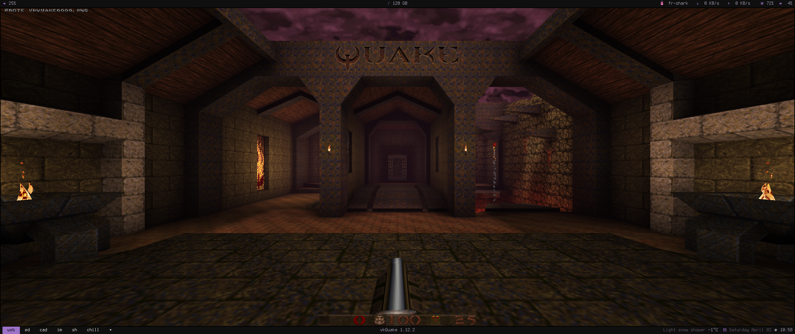

# [Quake](https://github.com/Novum/vkQuake)



## Install

1. `direnv allow`
2. Install [2021 re-release from Steam](https://store.steampowered.com/app/2310/QUAKE/) using Windows, copy `rerelease` content (dopa, id1, hipnotic, mg1, rogue) to this repo.
3. Download and extract [Arcane Dimensions](https://www.moddb.com/mods/arcane-dimensions) to `ad`

```
.
├── ad
│  ├── ad_1_8.def
│  ├── ad_1_8.fgd
│  ├── ad_v1_80_credits.txt
│  ├── ad_v1_80_documentation.txt
│  ├── ad_v1_80_readme.txt
│  ├── ad_v1_80changelog.txt
│  ├── ad_v1_80p1changelog.txt
│  ├── pak0.pak
│  ├── pak1.pak
│  ├── pak2.pak
│  └── quake.rc
├── dopa
│  └── pak0.pak
├── hipnotic
│  ├── music
│  │  ├── track02.ogg
│  │  ├── track03.ogg
│  │  ├── track04.ogg
│  │  ├── track05.ogg
│  │  ├── track06.ogg
│  │  ├── track07.ogg
│  │  ├── track08.ogg
│  │  └── track09.ogg
│  └── pak0.pak
├── id1
│  ├── music
│  │  ├── track02.ogg
│  │  ├── track03.ogg
│  │  ├── track04.ogg
│  │  ├── track05.ogg
│  │  ├── track06.ogg
│  │  ├── track07.ogg
│  │  ├── track08.ogg
│  │  ├── track09.ogg
│  │  ├── track10.ogg
│  │  └── track11.ogg
│  └── pak0.pak
├── mg1
│  └── pak0.pak
├── readme.md
├── rogue
│  ├── music
│  │  ├── track02.ogg
│  │  ├── track03.ogg
│  │  ├── track04.ogg
│  │  ├── track05.ogg
│  │  ├── track06.ogg
│  │  ├── track07.ogg
│  │  ├── track08.ogg
│  │  └── track09.ogg
│  └── pak0.pak
└── shell.nix
```

## Run 

Each folder a playable game and a parameter to `vkquake`:

* `vkquake` quake (uses `id1`)
* `vkquake -game hipnotic` Mission Pack 1: Scourge of Armagon
* `vkquake -game rogue` Mission Pack 2: Dissolution of Eternity
* `vkquake -game dopa` Dimension of the past 
* `vkquake -game mg1` Dimension of the Machine 
* `vkquake -game ad` [Arcane Dimensions](https://www.moddb.com/mods/arcane-dimensions) 
